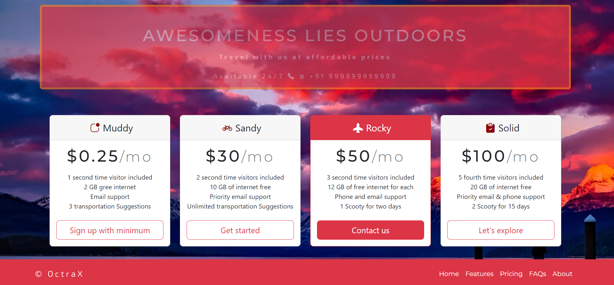

# OctraX Tourism Landing Page 

### Project Thumbnail

***
### Project details
This project is a landing page of a company named OctraX which is a tourism company. It is a purely responsive design , created for Desktop  mobile and tablet usage. Only UI is developed for this project for this project, functionality is not .  
Screen sizes
- Mobile(420px)
- Tablet(768px)
- Laptop(Full width)
- All screens

***
### Other Important Details
- >Time taken for completion : 30 mins
- Technologies Used
  - HTML
  - CSS
  - Bootstrap
- VSCode for coding
- Personal Learnings in this project 
    - HTML
    - CSS 
    - Bootstrap
- Deployed on *Vercel*  **[ClickMe]()** 
*** 
#### About Author

- ~ Pritam Pal ~
- Profession - Full Stack Developer
- Contact Email - pal.pritam1416131@gmail.com
- [Personal Website](#)
- [LinkedIn](https://www.linkedin.com/in/pritampal1/)  

